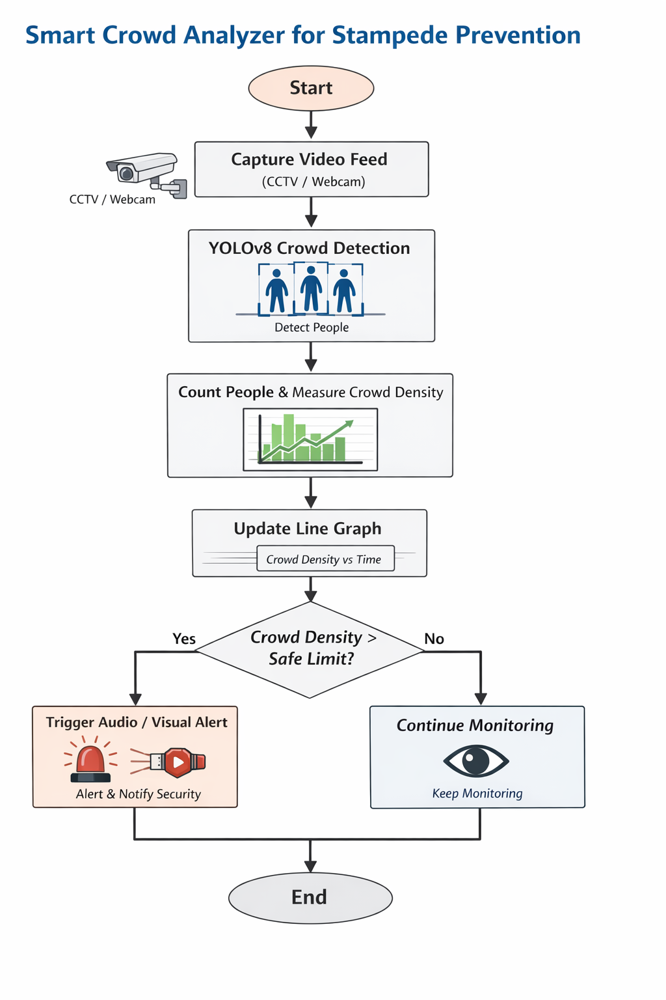
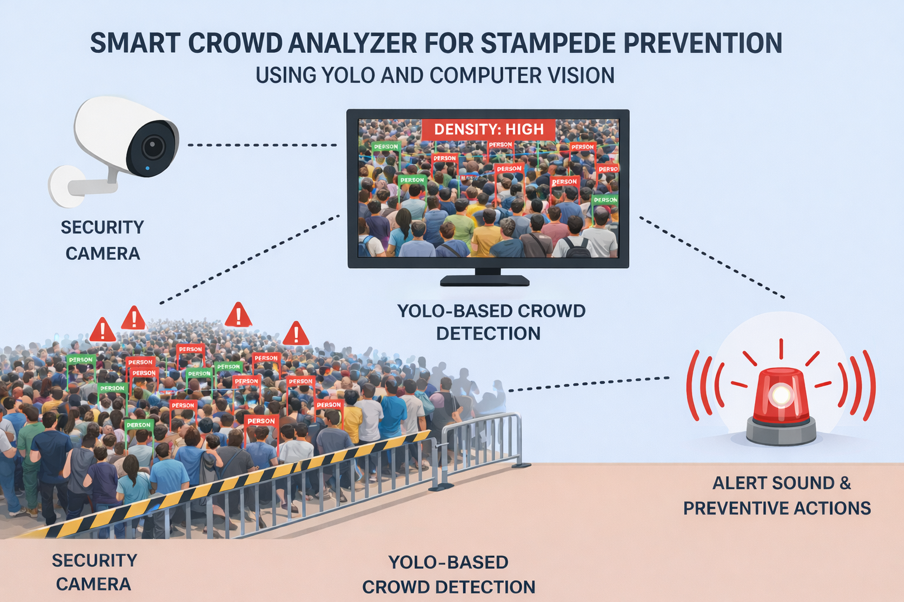

# Smart Crowd Analyzer for Stampede Prevention using YOLO and Computer Vision

## Description

**Smart Crowd Analyzer for Stampede Prevention** is an AI-powered computer vision system designed to monitor crowd density in real time and prevent stampede-like situations. Using **YOLO (You Only Look Once)** and **Computer Vision**, the system detects people from CCTV or webcam feeds, analyzes crowd density trends, and triggers **audio alerts** when unsafe thresholds are crossed.

This project is aimed at enhancing public safety in places such as **temples, railway stations, stadiums, festivals, and public gatherings**.

---

## Features

* **YOLOv8-based People Detection**
* **Real-time Crowd Counting**
* **Crowd Density Analysis over Time**
* **Dynamic Line Graph Visualization**
* **Automatic Audio Alert when Density Exceeds Threshold**
* **Supports Live CCTV / Webcam / Video Input**
* **Lightweight and Real-time Performance**
* **Social-impact focused AI solution**

---

## Flow Diagram



---

## Technology Stack

* **Programming Language:** Python
* **Computer Vision:** OpenCV
* **Deep Learning Model:** YOLOv8
* **Data Visualization:** Matplotlib
* **Audio Alerts:** Pygame / WAV alert system
* **Development Tools:** VS Code, Jupyter Notebook

---

## Project Structure

```bash
Smart-Crowd-Analyzer/
│
├── dataset/               # Training / test datasets
├── models/                # YOLO models
├── runs/                  # YOLO output runs
├── scripts/               # Utility scripts
├── alarm.wav              # Alert sound
├── data.yaml              # Dataset configuration
├── main.py                # Main execution file
├── model.py               # YOLO model logic
├── requirements.txt       # Python dependencies
├── yolov8n.pt             # YOLOv8 pretrained weights
├── README.md              # Project documentation
└── LICENSE                # MIT License
```

---

## Installation and Setup

### 1. Clone the Repository

```bash
git clone https://github.com/jeswathhub/Smart-Crowd-Analyzer.git
```

### 2. Navigate to the Project Directory

```bash
cd Smart-Crowd-Analyzer
```

### 3. Install Dependencies

```bash
pip install -r requirements.txt
```

---

## Usage

### Run the Crowd Analyzer

```bash
python main.py
```

### Execution Flow

* Captures live video feed
* Detects people using YOLO
* Counts individuals per frame
* Updates the crowd density graph
* Triggers an audio alert if the density crosses the safe limit

---

## Output

* Bounding boxes around detected individuals
* Live crowd count
* Line graph showing **Crowd Density vs Time**
* Audio alert during high-risk situations

---

## Use Cases

* Railway stations
* Temples and religious gatherings
* Concerts and public events
* Stadiums
* Public places and festivals

---

## Future Enhancements

* Integration with IoT-based warning systems
* Mobile dashboard alerts
* Web-based monitoring dashboard using Streamlit
* AI-based crowd movement prediction
* Automatic notification to authorities

---

## License

This project is licensed under the **MIT License**. See the `LICENSE` file for more details.




---

⭐If you find this project useful, consider starring the repository.
